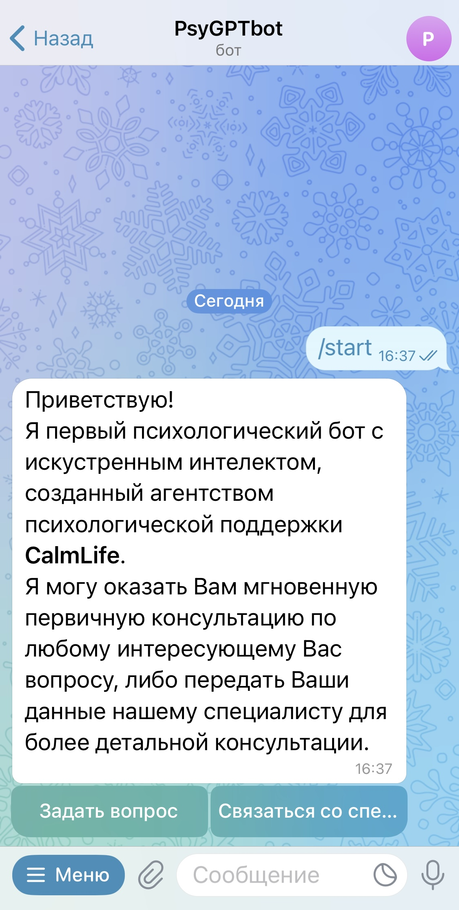
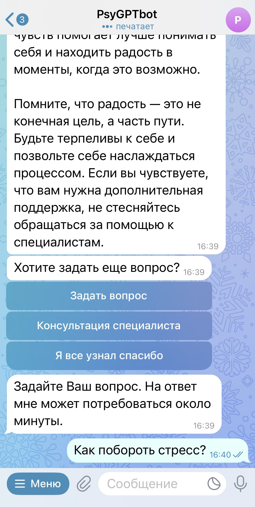
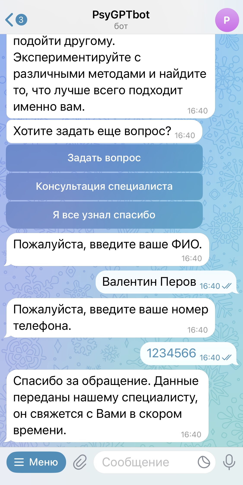
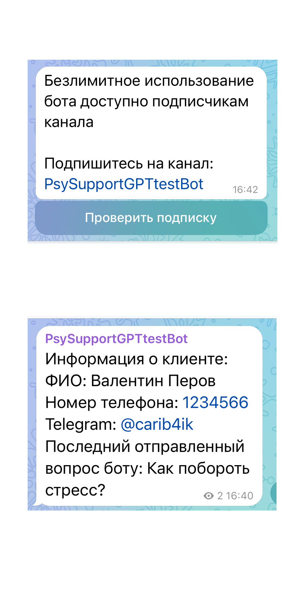

# PsySupportBot
Основные функции бота:
- Оказание психологической поддержки и консультаций пользователям с использованием искусственного интеллекта
- Передача данных пользователя менеджеру, для дальнейшей связи
- Побуждение пользователей подписываться на telegram-канал заказчика

## Скриншоты

  
  
  
  

